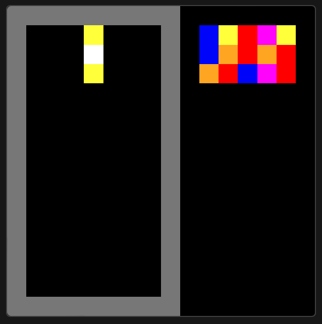
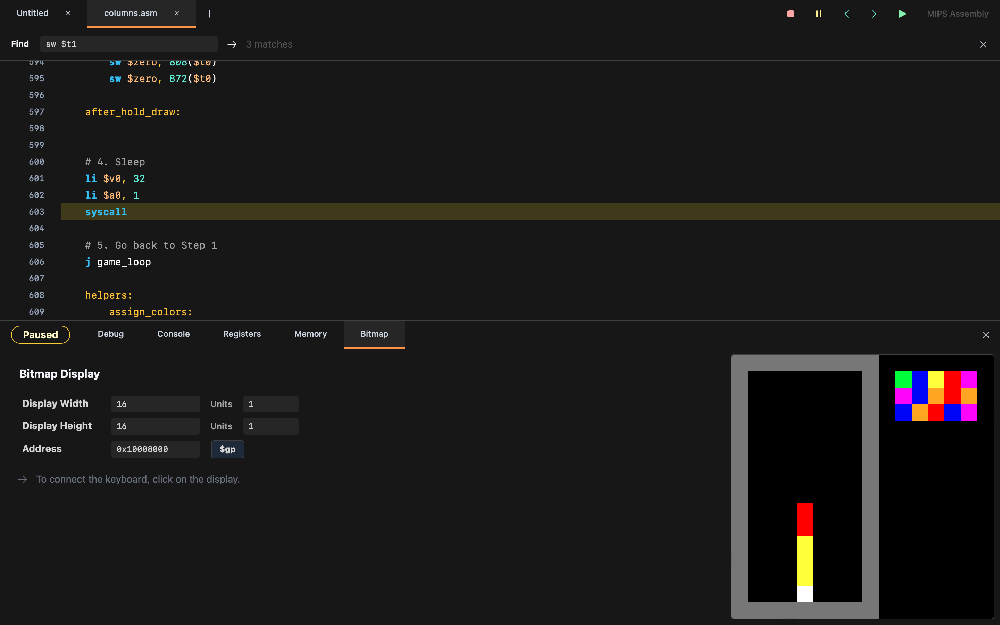
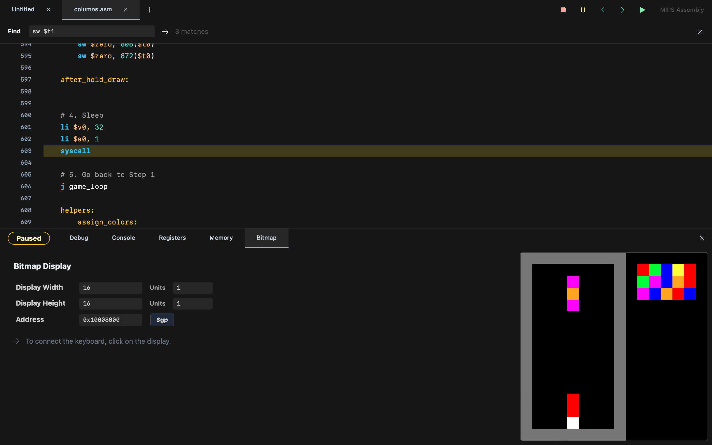
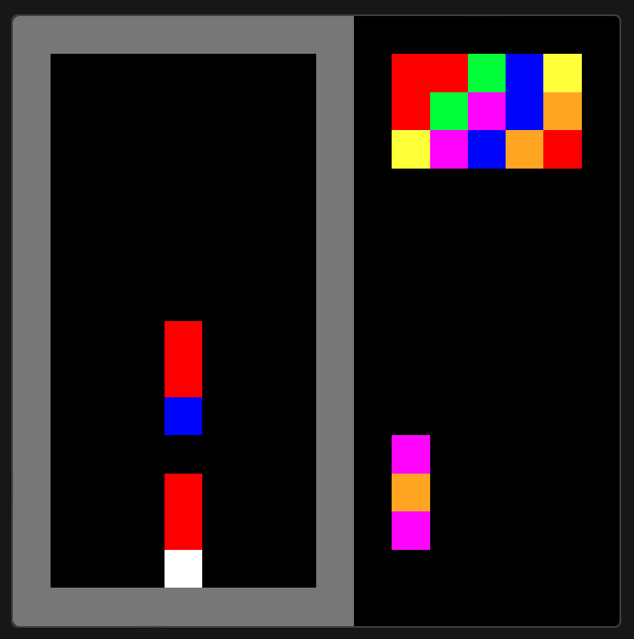
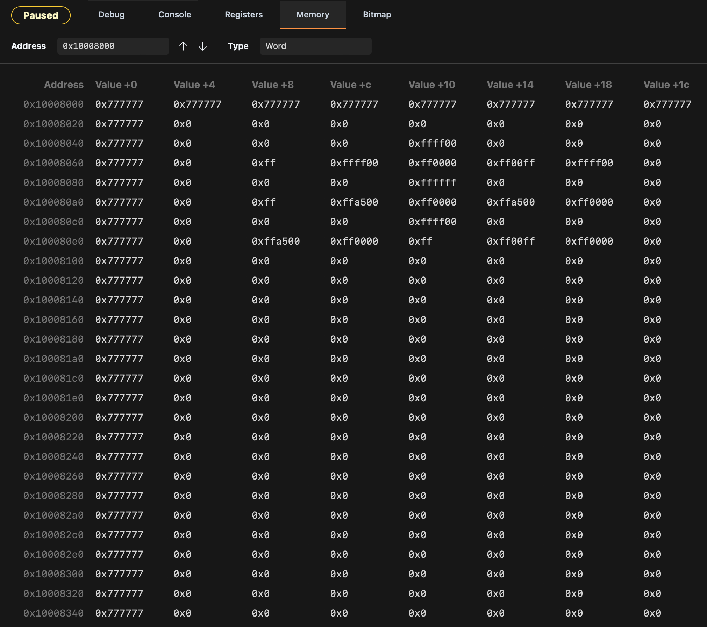

# Columns (CSC258 Assembly Project)

Columns recreated in MIPS assembly for the CSC258 bitmap display. The game runs entirely on the 16x16 bitmap grid (7x14 active playfield), including gravity, collision, matching, previews, and a save mechanic.

## Project Layout
- `columns.asm` — full game loop, keyboard polling, rendering, collision, matching, gravity, previews, and save logic.
- `img/` — gameplay captures and diagrams used below.
- `project_report.pdf` — original project write-up (source for this README).
- `LICENSE` — license information.

## Quickstart
- Environment: Saturn/MARS with the bitmap display mapped to `0x10008000`.
- Bitmap config: unit size 1x1 px; display size 16x16 px.
- Run: load `columns.asm`, start execution, open the Bitmap window, and click inside it to capture keyboard focus.

## Controls
- `W` rotate (cycle colours downward)
- `A/D` move left/right
- `S` soft drop
- `P` pause / resume
- `1/2/3` select Easy / Medium / Hard
- `C` save or swap the active column
- `Q` quit
- `R` restart after Game Over

## Gameplay & Mechanics
- Spawning: a three-gem vertical column spawns at row 1, col 4 with colours chosen from seven options.
- Gravity: automatic every frame; speed increases over time and by chosen difficulty.
- Movement/collision: wall, stack, and ground checks gate lateral moves and drops; landing locks the column to the board.
- Matching: horizontal, vertical, and diagonal groups of 3+ clear; gravity re-applies until the board stabilizes.
- Preview: right-to-left panel shows the next five columns.
- Save: stash the current column into a dedicated slot and swap it back when needed.
- Game Over: triggers if the spawn cell is occupied; restart clears state and regenerates the board.

## Feature Highlights
- Gravity timer with accelerating speed tied to difficulty
- Pause toggle and Game Over screen with restart flow
- Next five columns preview panel
- Save/swap column system
- Full match detection (horizontal, vertical, diagonal) with cascading gravity

## Memory Layout
- Base address `0x10008000`; 16 units per row (64 bytes).
- `CUR_ROW` / `CUR_COL` track the top gem of the active column.
- Board state is stored directly in bitmap memory (`0x000000` = empty).
- `NEXT1`–`NEXT5` hold the queued columns; `SAVED_TOP/MID/BOT` store the saved piece.

## How to Play
1) Move with `A/D`, rotate with `W`, and drop faster with `S`.
2) Pick difficulty (`1/2/3`) and watch gravity accelerate over time.
3) Press `C` to bank a column for later; swap it back when it fits a match.
4) `P` pauses/resumes; `Q` quits anytime.
5) On Game Over, press `R` to restart with a fresh state.

